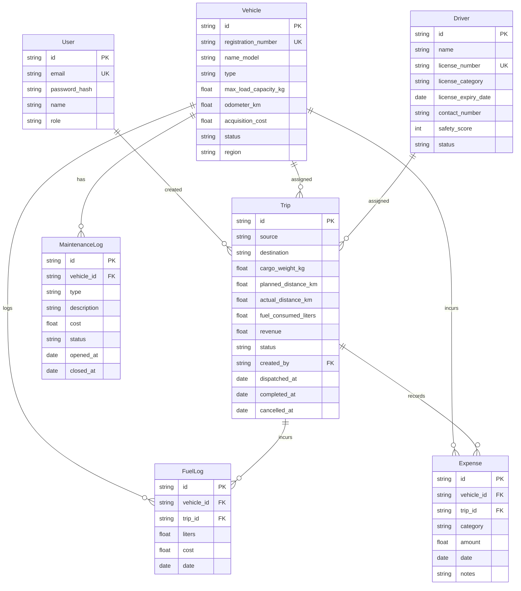

# ⚡ TransitOps — Smart Transport Operations Platform

<div align="center">


*A centralized, production-grade transport operations platform that digitizes vehicle, driver, dispatch, maintenance, and expense management while enforcing strict business rules and providing real-time operational insights.*

---

</div>

## 📖 Table of Contents

- [🎯 The Problem We Solve](#-the-problem-we-solve)
- [🚀 What We Built (Key Modules)](#-what-we-built-key-modules)
- [🛠️ Monorepo Technology Stack](#-monorepo-technology-stack)
- [🏗️ System Architecture & Data Flow Pipeline](#-system-architecture--data-flow-pipeline)
- [🗄️ Database Schema Design (Prisma)](#-database-schema-design-prisma)
- [🛡️ Automated Business Rules Enforced (Server-Side)](#-automated-business-rules-enforced-server-side)
- [🔐 Role-Based Access Control (RBAC) Matrix](#-role-based-access-control-rbac-matrix)
- [💻 Quick Start & Running the Project](#-quick-start--running-the-project)
- [📂 Project Structure](#-project-structure)
- [🧪 Suggested Walkthrough Scenario](#-suggested-walkthrough-scenario)

---

## 🎯 The Problem We Solve

Logistics and transport companies running operations on spreadsheets and paper logs struggle with operational inefficiencies:

1. **Double-Booking & Dispatch Conflicts**: Vehicles in active maintenance (`IN_SHOP`) or drivers with expired licenses get dispatched by mistake.
2. **Overweight Cargo Dispatches**: Vehicles are overloaded beyond their physical limitations, risking safety violations, road damage, and truck wear.
3. **Siloed Financials & Odometer Gaps**: Fuel logs and miscellaneous expenses are disconnected from the trips themselves, preventing accurate calculations of **Vehicle ROI** or true **Operational Costs**.
4. **License & Safety Blinds**: No automated enforcement to block expired licenses or suspended drivers from getting scheduled.

**TransitOps** solves these issues by pairing a beautiful glassmorphism React dashboard with a robust Node.js backend. All critical business decisions and state transitions are validated on both the client (for UX) and the server (via transactions for database integrity).

---

## 🚀 What We Built (Key Modules)

### 1. Unified Monorepo Suite
- **Web App (Frontend)**: React 18 dashboard styling featuring a dark-themed glassmorphism interface, interactive charts (Recharts), customizable layouts, and responsive components. Fully integrated with live REST APIs.
- **API Service (Backend)**: Express + TypeScript server implementing token authentication, role-based guard middlewares, Zod schema validation, and transactional Prisma queries.

### 2. Module Breakdown

- **Role Switcher Login (`/login`)**: Direct 1-click switcher to test user journeys across 4 roles: **Fleet Manager**, **Driver**, **Safety Officer**, and **Financial Analyst**.
- **KPI Command Center (`/dashboard`)**: Displays real-time aggregations (active/available vehicles, drivers on duty), **Fleet Utilization %**, fuel efficiency statistics, and a unified recent activity log.
- **Fleet Registry (`/vehicles`)**: Full vehicle management (trucks, vans, buses, cars). Enables tracking model specifications, regions, max capacity (kg), and status. Provides a soft-retire option.
- **Driver Registry (`/drivers`)**: Tracks contact cards, license classifications, and expiration dates. Highlights driver safety scores (`0-100`) and displays warning banners for expired or near-expiration licenses.
- **Split-Screen Trip Dispatcher (`/trips`)**: Side-by-side trip creation form and live dispatch board. Form validates physical vehicle load capacity before submission. Board handles transitions (`DRAFT` → `DISPATCHED` → `COMPLETED` / `CANCELLED`) with a dynamic stepper.
- **Maintenance Ledger (`/maintenance`)**: Log vehicle checkups and repair costs. Submitting a log automatically locks the vehicle status to `IN_SHOP` to exclude it from dispatching.
- **Expense & Fuel Ledgers (`/finance`)**: Records individual fuel logs (liters + cost) and general logistics costs (tolls, maintenance, other) to build a unified operational cost sheet.
- **Fleet Analytics & PDF/CSV Export (`/reports`)**: Aggregates top-cost vehicles, calculates ROI, charts monthly expenditures, and compiles a one-click CSV report generator.
- **Settings (`/settings`)**: General operations configurations showing depot names, currency formatting (`₹`, `$`), and a visual Role-to-Module access matrix.
- **AI Assistant**: A high-performance, context-aware AI chatbot integrated directly into the dashboard. It uses Google Gemini to answer fleet management questions instantly, equipped with a 30fps streaming throttle for zero UI lag.

---

## 🛠️ Monorepo Technology Stack

| Layer | Frontend (`apps/web`) | Backend (`apps/api`) |
| :--- | :--- | :--- |
| **Framework / Runtime** | **React 18 + Vite** | **Node.js + Express (TypeScript)** |
| **Language** | TypeScript (v5.5) | TypeScript (v5.5) |
| **Database ORM** | — | **Prisma ORM** |
| **Database Engine** | API Client (Fetch) | **SQLite** (`dev.db` for local velocity) |
| **State / Auth** | Zustand (Global State) | **JWT (jsonwebtoken)** + **Bcrypt.js** |
| **Validation** | Form boundaries | **Zod Schemas** |
| **Styling** | TailwindCSS + Framer Motion | Custom error formatting middleware |
| **Data Viz** | Recharts | Group By & Aggregate SQL Queries |

---

## 🏗️ System Architecture & Data Flow Pipeline

TransitOps uses a modern three-tier pipeline designed for high performance and integrity.

```text
       +---------------------------------------------+
       |             TransitOps React UI             |
       |  (Glassmorphism Cards, Modals, Forms, Lists)|
       +---------------------------------------------+
                              │  (REST API via Fetch)
                              ▼
       +---------------------------------------------+
       |             Express Router & Zod            |
       |   (Token Validation & Schema Enforcement)   |
       +---------------------------------------------+
                              │
                              ▼
       +---------------------------------------------+
       |            Controller Logic Layer           |
       |  (Atomic State Machine Transitions, RBAC)   |
       +---------------------------------------------+
                              │
                              ▼
       +---------------------------------------------+
       |             Prisma ORM & SQLite             |
       |  (Transactional Locks, DB Constraints)      |
       +---------------------------------------------+
```

### Flow Walkthrough

1. **User Request**: The user triggers an action (e.g., clicking *Complete Trip*).
2. **Auth & RBAC Middleware**: The API validates the client JWT bearer token, checks the user's role, and ensures permission to proceed.
3. **Zod Validator**: Request payloads are structurally validated (e.g., verifying `actual_distance_km` is positive and IDs are correctly formatted).
4. **Transaction Core**: The controller runs a Prisma `$transaction` block. This guarantees that multiple tables update atomically (e.g., updating the trip state to `COMPLETED`, returning the vehicle and driver to `AVAILABLE`, and appending the distance to the vehicle's odometer). If one action fails, the database rolls back completely to prevent data corruption.

---

## 🗄️ Database Schema Design (Prisma)

The backend data store uses a relational schema defined via Prisma ORM:



---

## 🛡️ Automated Business Rules Enforced (Server-Side)

The Node.js backend handles all logical constraints to serve as the single source of truth:

1. **Uniqueness**: Registration plates and driver license IDs are locked to a `@unique` constraint in the database.
2. **Vehicle Readiness Guard**: Trips cannot be created with a vehicle that is `RETIRED`, `IN_SHOP`, or already on a trip.
3. **Driver Compliance Guard**: Driver status must be `AVAILABLE` and their driver's license expiration date must be greater than the current date.
4. **Double-Dispatch Prevention**: Active checks block vehicles or drivers from being assigned to multiple concurrent active trips (`DRAFT` or `DISPATCHED`).
5. **Cargo Limit Check**: Trips reject cargo loads exceeding the target vehicle's maximum load capability.
6. **Dispatch Lock**: Changing a trip's status to `DISPATCHED` atomically changes the referenced vehicle and driver status to `ON_TRIP`.
7. **Odometer Update on Completion**: Completing a trip restores the vehicle and driver to `AVAILABLE` and increments the vehicle's `odometer_km` by the trip's actual distance.
8. **Trip Cancellation Rollback**: Cancelling a trip immediately releases the locked driver and vehicle to `AVAILABLE` without changing odometer values.
9. **Maintenance Locks**: Creating an open maintenance record locks the vehicle status to `IN_SHOP`.
10. **Maintenance Unlocks**: Closing a maintenance record resets the vehicle back to `AVAILABLE` only if there are no other open logs outstanding for it.
11. **Trip Lifecycle State Machine**: Enforces strict transitions:
    `DRAFT` ──► `DISPATCHED` ──► `COMPLETED` or `CANCELLED`. Direct state jumps are blocked.

---

## 🔐 Role-Based Access Control (RBAC) Matrix

API routes are protected via roles matching the frontend requirements:

| Role | Auth Endpoint | Vehicles | Drivers | Trips | Maintenance | Finance | Dashboard/KPIs |
| :--- | :---: | :---: | :---: | :---: | :---: | :---: | :---: |
| **Fleet Manager** | ✅ | **Full CRUD** | **Full CRUD** | View Only | **Full CRUD** | View Only | View KPIs |
| **Driver** | ✅ | View Only | View Only | **Full (DRAFT to End)** | View Only | Log Fuel | View KPIs |
| **Safety Officer** | ✅ | View Only | **Full CRUD** | View Only | View Only | View Only | View KPIs |
| **Financial Analyst** | ✅ | View Only | View Only | View Only | View Only | **Full CRUD** | View KPIs |

---

## 💻 Quick Start & Running the Project

Both the frontend and backend are pre-configured to run concurrently on local development ports.

### Prerequisites

- **Node.js (v20+)**
- **npm**

### Step 1: Install Dependencies

Run the install command in both monorepo folders:

```bash
# In the root repository directory
cd apps/web
npm install

cd ../api
npm install
```

### Step 2: Database Initialization & Seeding (SQLite)

Create the local SQLite database file, apply the schema, and seed the demo credentials:

```bash
cd apps/api

# Sync schema and create sqlite db (creates dev.db)
npx prisma db push

# Generate Prisma Client
npx prisma generate

# Seed database with demo accounts, vehicles, and drivers
npx tsx prisma/seed.ts
```

### Step 3: Start the Application Servers

Run the dev commands in separate terminals:

```bash
# Start backend API (runs on http://localhost:4000)
cd apps/api
npm run dev

# Start frontend Web Dashboard (runs on http://localhost:3000 or 3001)
cd apps/web
npm run dev
```

---

## 📂 Project Structure

```text
TransitOps/
├── apps/
│   ├── api/                   # TypeScript Node.js Backend API
│   │   ├── prisma/
│   │   │   ├── schema.prisma  # SQLite database model definition
│   │   │   └── seed.ts        # Database seed scripts
│   │   ├── src/
│   │   │   ├── auth/          # Login controller & JWT signing
│   │   │   ├── dashboard/     # KPI aggregator
│   │   │   ├── drivers/       # Driver management and status controls
│   │   │   ├── fuel-expense/  # Financial registries & cost analytics
│   │   │   ├── lib/
│   │   │   │   └── prisma.ts  # Singleton Prisma connection helper
│   │   │   ├── maintenance/   # Vehicle services and locks
│   │   │   ├── middleware/    # Auth check, RBAC role guard, global errors, Zod
│   │   │   ├── trips/         # Dispatch system & transaction logic
│   │   │   └── index.ts       # Server application setup
│   │   ├── package.json
│   │   └── tsconfig.json
│   │
│   └── web/                   # React Vite SPA Frontend App
│       ├── src/
│       │   ├── components/    # Layout modules (Sidebar, Topbar) & UI elements
│       │   ├── pages/         # 9 Dashboard modules
│       │   ├── services/      # REST API client & service adapters
│       │   ├── store/         # State management stores (Zustand)
│       │   ├── types.ts       # Central data structures
│       │   ├── App.tsx        # Routing engine
│       │   └── main.tsx       # Entry script
│       └── package.json
└── README.md                  # Unified platform manual
```

---

## 🧪 Suggested Walkthrough Scenario

To see the pipeline working from end-to-end, use this flow:

1. **Sign In**: Navigate to [http://localhost:3001/](http://localhost:3001/). Choose **Fleet Manager** or **Driver** and log in with the password `demo123`.
2. **Generate a Draft Trip**: Select a vehicle (e.g. `VAN-05`) and a driver (e.g. `Alex`). Enter a cargo weight that is within limits. Save the trip to create a `DRAFT`.
3. **Validate Load Rules**: Try creating a trip with cargo weight `700 kg` for `VAN-05` (500 kg limit). The backend API will block the request and alert you.
4. **Dispatch the Trip**: Under the *Live Board*, click the **Dispatch** button on your Draft Trip. The trip status shifts to `DISPATCHED`. If you check the *Vehicles* and *Drivers* pages, both entities are now automatically flagged as `ON_TRIP` on the backend.
5. **Log Fuel**: Go to the *Finance* panel, click *Log Fuel*, select the active vehicle, and enter liters and cost. The operational cost dashboard aggregates this automatically.
6. **Complete the Trip**: Return to the trips panel, click **Complete**, and input an actual distance (e.g. `120 km`). The trip shifts to `COMPLETED`, the vehicle and driver return to `AVAILABLE` status, and the vehicle's odometer updates to reflect the new mileage on the backend!

---

<div align="center">

**Built with ❤️ for the Oddo Hackathon | Powered by Antigravity**

</div>
